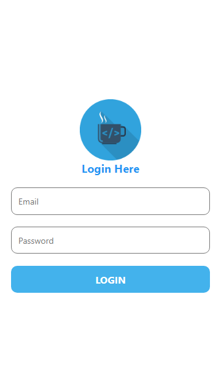

# Lab 12: Tugas Membuat Style

## Branch

Daftar branch untuk masing-masing Lab.

- [Lab 4: Membuat Project React Native Pertama dengan expo-cli](https://github.com/Abdurraziq/pengenalan-react-native/tree/Lab-4)
- [Lab 5: React Native Component](https://github.com/Abdurraziq/pengenalan-react-native/tree/Lab-5)
- [Lab 6: State & Event Bagian 1](https://github.com/Abdurraziq/pengenalan-react-native/tree/Lab-6)
- [Lab 7: State & Event Bagian 2](https://github.com/Abdurraziq/pengenalan-react-native/tree/Lab-7)
- [Lab 8: Style](https://github.com/Abdurraziq/pengenalan-react-native/tree/Lab-8)
- [Lab 9: Style Height & Width (Fixed Dimensions)](https://github.com/Abdurraziq/pengenalan-react-native/tree/Lab-9)
- [Lab 10: Style Height & Width (Flex Dimensions)](https://github.com/Abdurraziq/pengenalan-react-native/tree/Lab-10)
- [Lab 11: Responsive Design](https://github.com/Abdurraziq/pengenalan-react-native/tree/Lab-11)
- [Lab 12: Tugas Membuat Style](https://github.com/Abdurraziq/pengenalan-react-native/tree/Lab-12_Tugas-membuat-style-)
- [Lab 13: Tugas Membuat Halaman Login](https://github.com/Abdurraziq/pengenalan-react-native/tree/13)
- [Lab 14: React Navigation](https://github.com/Abdurraziq/pengenalan-react-native/tree/Lab-14)
- [Lab 15: Tugas React Navigation](https://github.com/Abdurraziq/pengenalan-react-native/tree/Lab-15_Tugas-3)

Keterangan:

*Lab 1 sampai 3 tidak dimasukkan karena hanya berupa langkah-langkah awal.*

## Hasil

