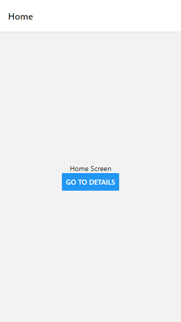

# Lab 15: Tugas React Navigation

## Branch

Daftar branch untuk masing-masing Lab.

- [Lab 4: Membuat Project React Native Pertama dengan expo-cli](https://github.com/Abdurraziq/pengenalan-react-native/tree/Lab-4)
- [Lab 5: React Native Component](https://github.com/Abdurraziq/pengenalan-react-native/tree/Lab-5)
- [Lab 6: State & Event Bagian 1](https://github.com/Abdurraziq/pengenalan-react-native/tree/Lab-6)
- [Lab 7: State & Event Bagian 2](https://github.com/Abdurraziq/pengenalan-react-native/tree/Lab-7)
- [Lab 8: Style](https://github.com/Abdurraziq/pengenalan-react-native/tree/Lab-8)
- [Lab 9: Style Height & Width (Fixed Dimensions)](https://github.com/Abdurraziq/pengenalan-react-native/tree/Lab-9)
- [Lab 10: Style Height & Width (Flex Dimensions)](https://github.com/Abdurraziq/pengenalan-react-native/tree/Lab-10)
- [Lab 11: Responsive Design](https://github.com/Abdurraziq/pengenalan-react-native/tree/Lab-11)
- [Lab 12: Tugas Membuat Style](https://github.com/Abdurraziq/pengenalan-react-native/tree/Lab-12_Tugas-membuat-style-)
- [Lab 13: Tugas Membuat Halaman Login](https://github.com/Abdurraziq/pengenalan-react-native/tree/Lab-13_Membuat-Halaman-Login)
- [Lab 14: React Navigation](https://github.com/Abdurraziq/pengenalan-react-native/tree/Lab-14)
- [Lab 15: Tugas React Navigation](https://github.com/Abdurraziq/pengenalan-react-native/tree/Lab-15_Tugas-3)

Keterangan:

*Lab 1 sampai 3 tidak dimasukkan karena hanya berupa langkah-langkah awal.*

## Penjelasan

### Import Module

Pertama-tama modul-module yang diperlukan di-import ke dalam kode program `App.js`.

```js
import React from "react";
import { Button, View, Text } from "react-native";
import { NavigationContainer } from "@react-navigation/native";
import { createStackNavigator } from "@react-navigation/stack";

```

Module-module tersebut antara lain:

1. `react` yang berisi fungsi yang diperlukan untuk mendefinisikan komponen *React*.
2. `reaact-native` yang berisi komponen-komponen dasar untuk react native.
3. `@react-navigation/native` Modul untuk mengintegrasikan React Native untuk React Navigation.
4. `@react-navigation/stack` Stack navigator untuk React Navigation.

### Membuat komponen halaman

Terdapat dua komponen halaman yang dibuat antara lain:

#### 1. `HomeScreen`

Komponen halaman `HomeScreen` terdiri dari sebuah komponen parent `View` yang di-*style*-kan dengan `flex=1` (memenuhi seluruh ukuran layar) dan orientasi komponen *child*-nya diatur ketengah-tengah layar. Didalam komponen `View` tersebut terdapat dua komponen, yaitu;

1. `Text` untuk menampilkan teks **Home Screen**.
2. `Button` yang diset jika ditekan (`onPress`) maka akan membuka halaman **Detail**.

```jsx
const HomeScreen = ({ navigation }) => {
  return (
    <View style={{ flex: 1, alignItems: "center", justifyContent: "center" }}>
      <Text>Home Screen</Text>
      <Button
        title="Go to Details"
        onPress={() => navigation.navigate("Details")}
      />
    </View>
  );
};
```

#### 2. `DetailScreen`

Sama seperti halaman `HomeScreen`, halaman `DetailScreen` juga memiliki sebuah komponen parent berupa `View` yang diatur *style*-nya dengan `flex=1` (memenuhi seluruh ukuran layar) dan orientasi komponen *child*-nya ketengah-tengah layar. Didalam komponen `View` tersebut terdapat lima komponen lainnya yaitu;

1. `Text` yang menampilkan teks **Home Screen**.
2. `Button` yang jika ditekan maka akan membuka halaman Detail kembali.
3. `Button` yang jika ditekan maka akan membuka halaman Home.
4. `Button` yang jika ditekan maka akan kembali ke halaman sebelumnya.
5. `Button` yang jika ditekan maka akan membuka halaman yang paling awal.

```jsx
const DetailScreen = ({ navigation }) => {
  return (
    <View style={{ flex: 1, alignItems: "center", justifyContent: "center" }}>
      <Text>Details Screen</Text>
      <Button title="Go to Details... again" onPress={() => navigation.push("Details")} />
      <Button title="Go to Home" onPress={() => navigation.navigate("Home")} />
      <Button title="Go Back" onPress={() => navigation.goBack()} />
      <Button title="Go back to first screen in stack" onPress={() => navigation.popToTop()} />
    </View>
  );
};
```

### Membuat Komponen `App`

Komponen ini mengimplementasikan sebuah Stack Navigator dengan meggunaan NavigationContainer untuk mengelola *state* aplikasi dan menghubungkan navigator tingkat atas dengan lingkungan aplikasi.

```jsx
const stack = createStackNavigator();

const App = () => {
  return (
    <NavigationContainer>
      <stack.Navigator initialRouteName="home">
        <stack.Screen name="Home" component={HomeScreen} />
        <stack.Screen name="Details" component={DetailScreen} />
      </stack.Navigator>
    </NavigationContainer>
  );
};

export default App;
```

## Hssil

### Halaman Home



### Halamn Detail


